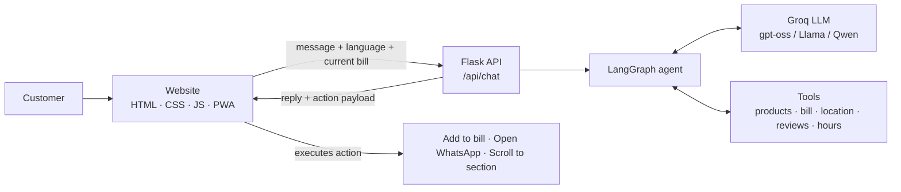

# 🐄 Angel Organics - Premium Gir Cow Dairy Farm

<div align="center">


**Premium A2 Milk & Organic Dairy Products from Ajmer, Rajasthan**

**Full-stack website with an agentic AI assistant that can act on the page: build your bill, send your order on WhatsApp, and guide you around the site.**

[🌐 Live Website](https://angelgirorganics.onrender.com) · [🤖 Backend Health](https://angel-organics-backend.onrender.com/api/health) · [📱 Instagram](https://instagram.com/angelorganic_ajmer) · [📞 +91 8811013758](tel:+918811013758)

</div>

---

## 📖 About Angel Organics

Angel Organics is a Gir cow dairy farm in **Arjunpura Jageer, Ajmer, Rajasthan**. Dr Sunil Rai personally oversees the health and well-being of every cow and calf. Our indigenous Gir cows naturally produce **100% A2 milk**, with zero hormones, antibiotics, or artificial additives.

> *शुद्धता हमारा वादा है… आपसे। क्योंकि जो हमारे बच्चे के लिए सही नहीं, वो आपके बच्चे के लिए भी नहीं..*

| 🐄 Premium Gir Cows | 🥛 Liters Daily Production | 👨‍👩‍👧 Happy Families |
|:---:|:---:|:---:|
| **20+** | **100+** | **60+** |

### 🥛 Products

| Product | Price | Highlights |
|---------|-------|------------|
| **Fresh Gir Cow A2 Milk** | ₹75 per liter | 100% A2 protein, daily fresh, no preservatives |
| **Golden A2 Ghee** | ₹2500 per kg / ₹1300 for 500gm | Bilona method, pure A2 ghee |
| **Fresh Butter** | ₹1200 per kg | Farm fresh, creamy texture, natural taste |
| **Probiotic Buttermilk** | ₹30 per liter | Rich probiotics, digestive health |
| **Thick Curd** | ₹100 per kg | Live cultures, thick & creamy |

🚚 **FREE delivery** on all orders · 🎉 **5% bulk discount** on orders above ₹2000 · ⏰ **Open daily** 6:00 AM - 8:00 PM

---

## ✨ Features

### 🤖 Agentic AI Assistant
- **Acts on the website, not just chats**: *"add 2 liters milk and 500g ghee to my bill"* adds them to the Bill Calculator; *"send my order"* opens WhatsApp with the full bill; *"show me reviews"* scrolls the page there.
- **Knows the customer's bill**: the current cart is sent with every message, so the agent can answer *"what's in my bill?"*.
- **Grounded answers**: only states facts from the business data and tools (prices, products, real reviews quoted verbatim); suggests WhatsApp/call instead of guessing.
- **Bilingual** English / Hindi, **voice input & output** (Web Speech API).
- **Markdown replies** rendered with [marked](https://github.com/markedjs/marked) and sanitised by [DOMPurify](https://github.com/cure53/DOMPurify).
- **Export chat** to PDF or JSON.
- **Offline fallback**: if the server is asleep, the chatbot still answers common questions from website data.

### 🛒 Website
- **Add to Bill** on every product card (with 1 kg / 500 g ghee option), shared with the **Bill Calculator**.
- Per-item quantity steppers, live **bulk-discount progress bar**, cart saved across visits.
- **Send Bill to WhatsApp**, Print Bill, Copy Bill; Order Request Form that can attach bill items.
- **"Open now" badge** from working hours (India time).
- Farm **gallery** with swipe/keyboard lightbox, **review slider**, farm videos, Google Map with share location.
- **Installable app (PWA)** with offline support and an "Install App" button.
- Responsive, mobile-first, accessible design; lazy-loaded media; no heavy UI frameworks.

---

## 🏗️ Architecture



**How an agentic turn works**

1. The browser sends the message, chosen language and the current bill to `/api/chat`.
2. The LangGraph agent (ReAct-style loop with checkpointed memory per session) decides whether to answer directly or call a tool.
3. Tools return JSON, including an `action` payload (e.g. `add_to_cart` with items).
4. The API returns the reply plus the action; the chatbot carries it out through `window.AngelSite` (a small API exposed by `site.js`) and shows what it did.

### 🛠️ Agent tools

| Tool | What it does |
|------|-------------|
| `add_to_bill` | Adds products to the website bill (`milk:2,ghee500:1`) |
| `send_bill_on_whatsapp` | Opens WhatsApp with the customer's current bill |
| `open_website_section` | Scrolls to products, gallery, calculator, reviews, contact, location |
| `check_farm_open_now` | Open/closed status from working hours (India time) |
| `get_customer_reviews` | Real customer reviews from the website, verbatim |
| `get_product_info` | Product details and price (understands dahi, chaas, makhan, doodh) |
| `show_all_products` | Full product list with prices |
| `calculate_order_total` | Bill total with the 5% bulk discount |
| `create_whatsapp_order` | WhatsApp order link for given order details |
| `get_farm_location` | Address, hours, directions and map |
| `get_health_benefits` | A2 milk benefits by topic |
| `show_gallery` | Points the customer to the farm photo gallery |

### 🧠 Model selection
At startup the backend asks Groq which models the API key can use and picks the first available from this list of open-weight, tool-calling models:

`openai/gpt-oss-20b` → `openai/gpt-oss-120b` → `qwen/qwen3.8-27b` → `meta-llama/llama-4-scout-17b-16e-instruct` → `qwen/qwen3-32b` → `llama-3.3-70b-versatile` → `llama-3.1-8b-instant`

Set `GROQ_MODEL` to force a specific model. The active model is shown at `/api/health`.

---

## 📁 Project Structure

```
angelgirorganics/
├── backend/
│   ├── chatbot_backend.py      # Flask API + LangGraph agent (active)
│   ├── requirements.txt        # Python dependencies
│   └── Procfile                # Gunicorn start command
│
├── frontend/                   # Static site (Render publish directory)
│   ├── index.html              # Website
│   ├── manifest.webmanifest    # PWA manifest
│   ├── sw.js                   # Service worker (offline support)
│   ├── css/
│   │   ├── site.css            # Website styles
│   │   └── chatbot.css         # Chatbot styles
│   ├── js/
│   │   ├── site.js             # Bill calculator, gallery, PWA, window.AngelSite API
│   │   ├── chatbot-frontend.js # Chatbot UI + agent action handling
│   │   ├── api-config.js       # Backend URL (local vs production)
│   │   └── vendor/             # marked, DOMPurify (self-hosted)
│   └── assets/
│       ├── images/             # Product & farm photos, chatbot avatar
│       ├── icons/              # App icons
│       └── videos/             # Farm videos
│
├── config/.env.example         # Environment variable template
├── docs/                       # Older guides and notes
├── posters/                    # LaTeX posters (English & Hindi)
├── scripts/                    # Utility scripts
├── render.yaml                 # Render blueprint (backend + frontend)
├── requirements.txt            # Points to backend/requirements.txt
└── runtime.txt                 # Python version for Render
```

> Older files (`backend/chatbot.py`, `agentic_chatbot.py`, `chatbot_backend_old.py`, `frontend/css/style.css`, `frontend/js/script.js`, etc.) are not used by the live site.

---

## 🚀 Getting Started

### Prerequisites
- Python 3.11+
- A free Groq API key: [console.groq.com/keys](https://console.groq.com/keys)

### 1. Clone
```bash
git clone https://github.com/Susanta2102/angelgirorganics.git
cd angelgirorganics
```

### 2. Backend
```bash
cd backend
python3 -m venv venv
source venv/bin/activate          # Windows: venv\Scripts\activate
pip install -r requirements.txt
cp ../config/.env.example .env    # then add your GROQ_API_KEY
python chatbot_backend.py         # http://localhost:5000
```

### 3. Frontend
```bash
cd frontend
python3 -m http.server 8000       # http://localhost:8000
```
On `localhost` the chatbot automatically talks to `http://localhost:5000` (see `frontend/js/api-config.js`).

### 4. Try the agent
- "add 2 liters milk and a 500g ghee to my bill"
- "what's in my bill?" → "send it on WhatsApp"
- "are you open now?"
- "show me customer reviews"
- "buttermilk price" / "dahi kitne ka hai?"

---

## ⚙️ Configuration

| Variable | Required | Description |
|----------|:---:|-------------|
| `GROQ_API_KEY` | ✅ | Groq API key |
| `GROQ_MODEL` | | Force a model instead of automatic selection |
| `PORT` | | Port for local runs (default `5000`) |
| `FLASK_ENV` | | Set to `development` for debug mode locally |

---

## 🌐 Deployment (Render)

Two services from the same GitHub repo; pushes to `main` deploy automatically.

**Backend: Web Service (Python)**
- Build Command: `pip install -r requirements.txt`
- Start Command:
  ```
  cd backend && gunicorn chatbot_backend:app --bind 0.0.0.0:$PORT --workers 1 --threads 4 --timeout 120
  ```
- Environment: `GROQ_API_KEY` (and optionally `GROQ_MODEL`)
- URL: https://angel-organics-backend.onrender.com

> Use **one worker** with threads: conversation memory is kept in the process, so multiple workers would each have separate memory and the bot would forget context.

**Frontend: Static Site**
- Publish Directory: `frontend`
- Build Command: none
- URL: https://angelgirorganics.onrender.com

If you change the backend URL, update `frontend/js/api-config.js`.

### API

| Method | Endpoint | Description |
|--------|----------|-------------|
| `GET` | `/api/health` | Status and active model |
| `POST` | `/api/chat` | `{ message, session_id, language: "en"\|"hi", cart: [{id, quantity}] }` → `{ response, action? }` |
| `POST` | `/api/export-chat` | Server-side transcript for a session |
| `GET` | `/tools` | List of agent tools |

```bash
curl https://angel-organics-backend.onrender.com/api/health

curl -X POST http://localhost:5000/api/chat \
  -H "Content-Type: application/json" \
  -d '{"message": "add 2 liters milk to my bill", "session_id": "test123", "cart": []}'
```

---

## 🩺 Troubleshooting

| Problem | Fix |
|---------|-----|
| Groq logs show `404 model_not_found` | The model was retired. Remove `GROQ_MODEL` to use automatic selection, or set it to a current model from [Groq's model list](https://console.groq.com/docs/models). |
| First chat reply takes ~1 minute | Free Render services sleep when idle; the first request wakes them. The chatbot waits up to 70 s and falls back to offline answers. |
| Bot forgets earlier messages | Make sure the Start Command uses `--workers 1 --threads 4`. |
| Images missing on the live site | All media must live in `frontend/assets/` (only `frontend/` is published). |
| Old version still showing after deploy | Hard refresh (Ctrl+Shift+R); the service worker refreshes cached files in the background. |

---

## 🔧 Tech Stack

**Backend:** Python · Flask · Flask-CORS · LangGraph · LangChain · langchain-groq · Groq API · Gunicorn

**AI:** Open-weight LLMs on Groq (gpt-oss, Llama, Qwen) · tool calling · checkpointed conversational memory

**Frontend:** HTML5 · CSS3 · Vanilla JavaScript · PWA (Service Worker, Web App Manifest) · Web Speech API · marked · DOMPurify · Font Awesome · Google Fonts

**Deployment:** Render (Python web service + static site) · Git · GitHub

---

## 🔮 Future Roadmap

- [ ] Online payment integration
- [ ] Subscription plans
- [ ] Product reviews & ratings
- [ ] Delivery tracking
- [ ] Recipe suggestions
- [ ] Nutritional calculator
- [ ] Loyalty rewards program
- [ ] Persistent chat memory (Redis/database) to support multiple workers

---

## 🤝 Contributing

1. Fork the repository
2. Create a feature branch: `git checkout -b feature/amazing-feature`
3. Commit your changes: `git commit -m "Add amazing feature"`
4. Push the branch: `git push origin feature/amazing-feature`
5. Open a Pull Request

---

## 📞 Contact

- **Phone / WhatsApp:** [+91 8811013758](https://wa.me/918811013758)
- **Email:** [drsunilkrai1975@gmail.com](mailto:drsunilkrai1975@gmail.com)
- **Instagram:** [@angelorganic_ajmer](https://instagram.com/angelorganic_ajmer)
- **Farm:** Angel Farm House, Arjunpura Jageer, Ajmer, Rajasthan 305203, India · [Google Maps](https://maps.app.goo.gl/293WBoybHLjSEcer7)
- **Hours:** Daily 6:00 AM - 8:00 PM

---

## 🙏 Acknowledgments

- **Dr Sunil Rai**: Founder
- **Susanta Baidya**: Full Stack AI Developer ([GitHub](https://github.com/Susanta2102) · [LinkedIn](https://www.linkedin.com/in/susanta-baidya-03436628a/))
- [Groq](https://groq.com) · [LangChain & LangGraph](https://www.langchain.com) · [Render](https://render.com) · [marked](https://github.com/markedjs/marked) · [DOMPurify](https://github.com/cure53/DOMPurify) · [Font Awesome](https://fontawesome.com)

---

## 📄 License

© Angel Organics. All rights reserved.

---

<div align="center">

**Made with ❤️ by [Susanta Baidya](https://github.com/Susanta2102) in Ajmer, Rajasthan**

**Pure Milk, Pure Love, Pure Life** 🐄🥛


</div>
